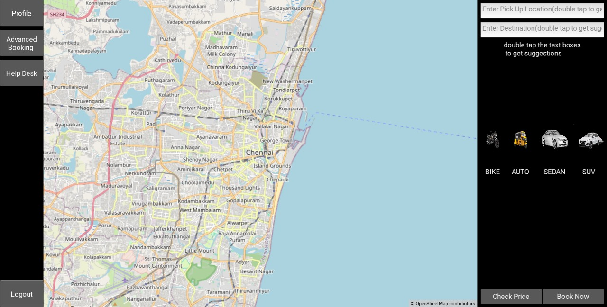
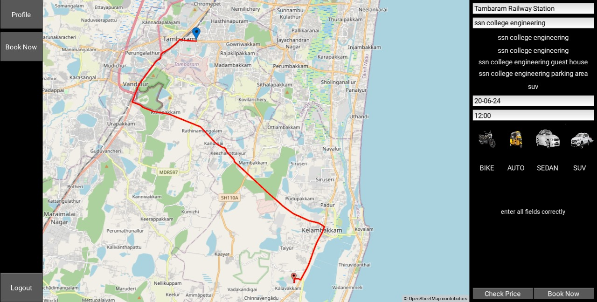
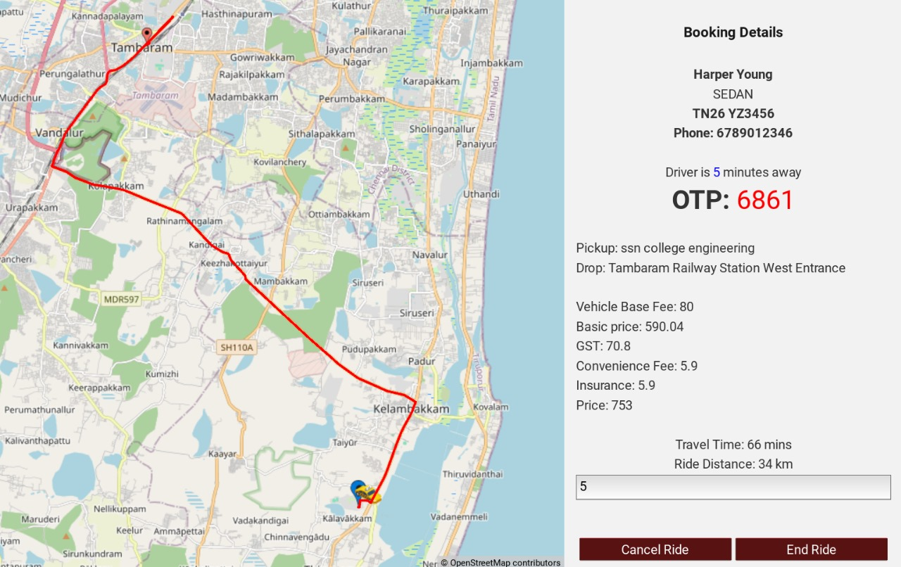
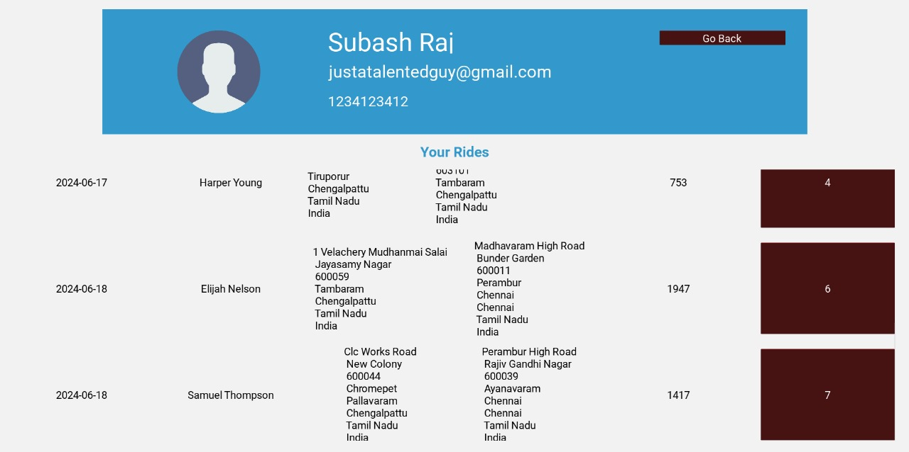
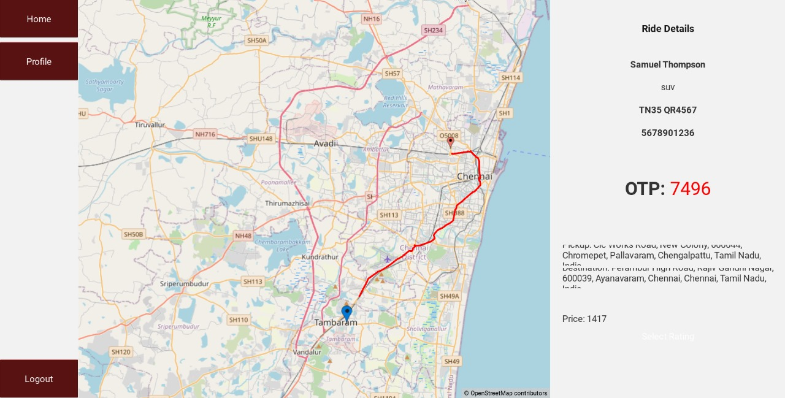

# Cab-Booking-App

Welcome to the Cab Hailing Application! This project is a mobile application built using Kivy and Python, designed to provide users with a seamless experience for hailing cabs. Whether you need a ride to work, a trip to the airport, or a night out, our app connects you with reliable drivers in just a few taps.

## Features

- **User Registration and Login:** Securely register and log in to your account.
- **Real-Time Cab Booking:** Book cabs in real-time with instant confirmation.
- **Driver Tracking:** Track your driver’s location in real-time on the map.
- **Fare Estimation:** Get an estimated fare for your ride before booking.
- **Rating and Feedback:** Rate your driver and provide feedback after your ride.

## Technologies Used

- **Kivy:** An open-source Python library for rapid development of applications that make use of innovative user interfaces, such as multi-touch apps.
- **Python:** The core programming language used for the application logic and backend integration.
- **SQLite:** A lightweight database for storing user and trip data locally.
- **REST API:** Integration with database for storing user and trip data in a server.

## Screenshots

**Home Page**

**Advance Booking Page**

**Ride Details Page**

**Profile Page**

**Page to View Previous Ride Details**

## Getting Started

To get started with the Cab Hailing Application, follow the instructions below to set up the project on your local machine.
**1. Install python, preferrably 3.6 or higher**
**2. Install the given python libraries, the commands for the same are given below**
- Django
- Django Restframework
- Geopy
- Kivy
- Mapview
- Flask
- Flask socket-io
- **Commands for installing the above repositories are:**
  - pip install django djangorestframework geopy
  - pip install kivy
  - pip install mapview
  - pip install flask flask-socketio

## Setting Up the Servers

Before starting the application, follow the instructions below to setup the servers needed for the app to function
- **Running the django server:**
  - Go to DriverAPI directory inside the main directory
  - Open the terminal in the current directory
  - run the following command to activate the server: **python manage.py runserver**
- **Running the chat server used to connect the driver and the user or the admin and the user:**
  - Go to Chats directory inside the main directory
  - Open terminal in the Chats directory
  - run the following command to activate the chat server: **python chat_server.py**

## Starting and Using the Application

To start the application, follow the instructions below
- Ensure that the django server is activated to access the database.
- Ensure that the chat server is activated to access the chat between the driver and the user.
- Now go to the main directory.
- To start the application, enter the given command: **python main.py**

## Lisence

This project is licensed under the GPL-3.0 License - see the LICENSE file for details

## Contact

Siddharth M - siddharth2370027@ssn.edu.in
Ponsubash Raj R - ponsubashraj2370043@ssn.edu.in
Sivasriraman P - sivasriraman2370066@ssn.edu.in
